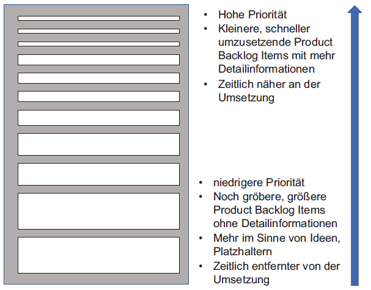
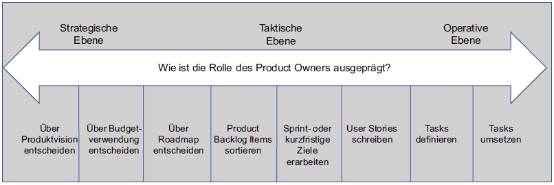
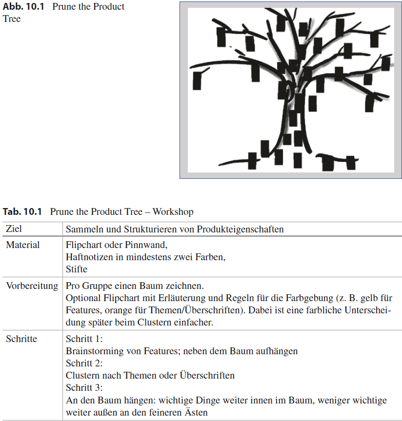
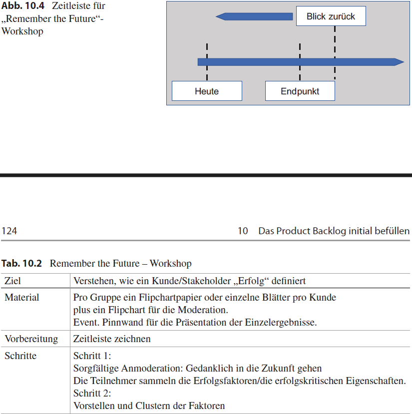
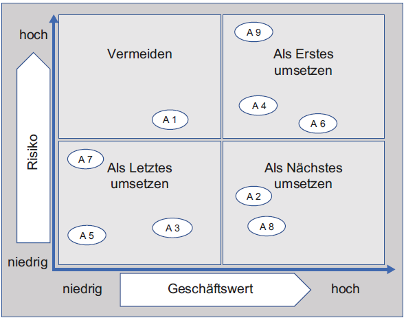
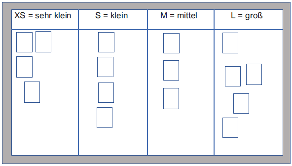
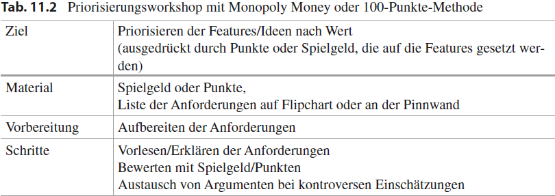
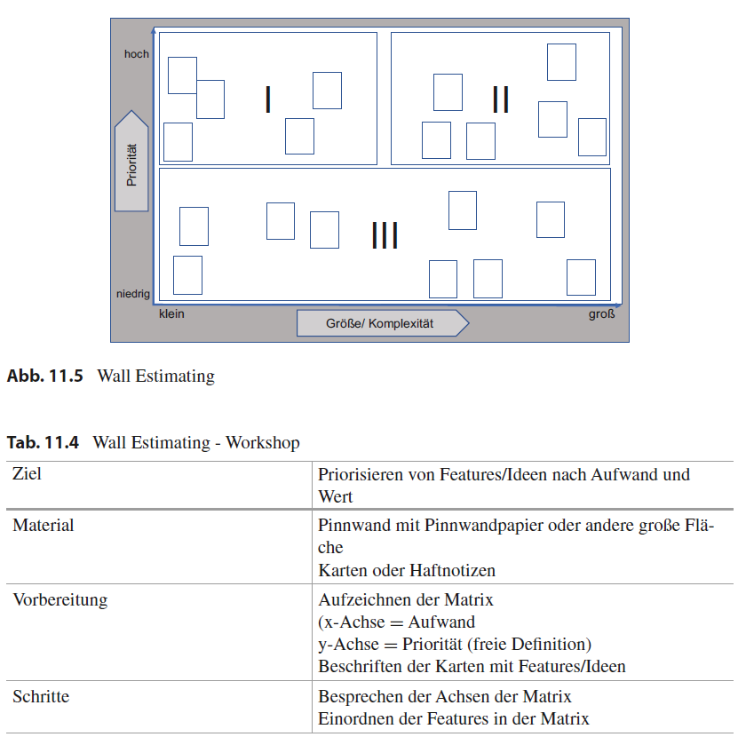

# Informationen Präsentation

# Kapitel 9
Seiten: 107 - 115
Einführung in das Product Backlog - ein Ort für alle Arbeit

- Was gemacht wird und in welcher reihenfolge 

Das product Backlog ist eine List die abzuarbeitende aufgaben (Items) beinhaltet. 
Die List ist von oben (Hoch) nach unten (Niedrig) priorisiert.

Je höher ein Item, desto detaillierter ist dieses schon ausgearbeitet, weshalb es weniger Platz auf dem product backlog
in anspruch nimmt. Je niedriger ein Item ist, desto gröber ist die ausarbeitung, weshalb noch viele Ideen oder
Möglichkeiten dieses Item umzusetzen, die Item beschreibung in der größe aufblähen. Die oben stehenden Items werden in
naher Zukunft umgesetzt. Die unten stehenden items spät bis gar nicht. Die wichtigsten Dinge zuerst.

#### Backlog ist DEEP:
- detailed appropriately --> Items unterschiedlich ausgearbeitet
- Emergent --> Backlog nicht statisch, kann sich durchgehend entwickeln
- Estimated --> Items sind geschätzt auf ihren Wert (Nach Umsetzung) oder ihre Komplexität und Aufwand
- Prioritized --> wichtig oben, unwichtig unten

#### Product Owner
Einzige für das Management des Product Backlog verantwortliche person

Aufgaben:
- einträge klar formulieren
- einträge sortieren --> ziele und missionen sollen optimal erreicht werden
- wert der Arbeit optimieren
- Product Backlog soll: sichtbar, transparent, klar, zeigt woran als n#chstes gearbeitet wird

Die Entscheidungen des Product Owner müssen respektiert werden
Der PO ist damit auch verantwortlich für erfolg des Projekt und ROI (Return On Invest)

#### Product Owner und Projektleiter 
Die Rollenverteilung sollte im Vorhinein klar eingeteilt sein, da es hier nur empfehlungen aber keine festen
vorgaben gibt. 

Kompetenzen und Verantwortungen werden im Project Charter festgelegt.

Mögliche Aufgabenspanne des Product Owners:

------------------------------------------------------------------------

# Kapitel 10
Seiten: 117 - 127

# Das Product Backlog initial befüllen

Das Ergebnis des Projektes ist das Produkt.

Agile Methoden
- anforderungen auf Haftnotizen sammeln
- anforderungen strukturieren --> ähnliche dinge clustern und priorisieren

## Prune the Product Tree (Die anforderungen und to-Do's sammeln und strukturieren)
**Ziel:** das Produkt mit den richtigen anforderungen in Form bringen (für den Markt "trimmen")

- Baum auf Pinnwand malen, haftnotizen an die äste des baumes pinnen
- äste --> funktionsbereiche/Themen
- haftnotizen --> anforderungen/features

Unterscheidung zwischen neu entwicklung (produkt eigenschaften sammeln) oder weiter entwicklung ("trimming")..

Neu entwicklung:
1. Brainstorming --> pro anforderung eine haftnotiz
2. clustern --> zusammengehörende anforderungen zusammenhängen und äste beschriften (optional)
3. Erstes grobes Priorisieren --> je wichtiger eine anforderung, desto dichter kommt sie an den dicken ast oder stamm

am Ende den baum nochmal im Ganzen betrachten und entscheiden ob ergänzungen oder korrektionen nötig sind.

weiter entwicklung:
- aktuell existierende features im Baumstamm
- äste: gewünschte neue features (oder vorhandene zu trimmende features)

## Remember the Future - Was war das Erfolgsgeheimnis
- in die Zukunft denken und sich fragen, was das Erfolgsgeheimnis des Projekts war
- zusammen mit Kunden und Stakeholdern

Zeitleiste: (z.B. aufgezeichnet)
- heutiger Tag
- Endpunkt (um diesen Punkt wird es gehen)
- Zeitpunkt etwas nach dem Endpunkt (Zeitpunkt des Rückblicks)

Teilnehmer begeben sich gedanklich an den zeitpunkt des Rückblicks und beantworten die Fragen vom Projektleiter.
(Es wird so getan als wäre das Projekt schon fertig)

> nach dem Durchführen dieser Methoden kann dann ein erstes Product Backlog designt werden

-----------------------------------------------------------------------------------------------------------------------

# Kapitel 11
Seiten: 129 - 148

# Priorisieren - Was ist wie wichtig?

Agile Projekte - in der zur verfügung stehenden Zeit den Nutzen und Wert maximieren

reihenfolge im backlog kann von verschiedensten beeinflusst werden:
- geschäftswert
- bedeutung aus kundensicht
- risiken
- cost of delay
- Komplexität in der Umsetzung oder Aufwand und Kosten in der fortlaufenden
  Pflege, usw.

tools zur priorisierung:
- relative Schätzung mit T-Shirt-Größen
- einfaches Priorisieren
- Abstufung mit MuSCoW
- Monopoly Money, 100-Punkte oder „Buy a Feature“,
- Planning Poker®,
- Wall Estimation.

Was kann die Priorisierung des Product Backlogs beeinflussen?
- Nutzen oder Geschäftswert eines Items
- Wichtigkeit aus Kundensicht (Relevanz)
- Die Adressierung von **Risiken** wirtschaftlicher oder technischer Art
- Die **Cost of Delay**, also die Verzögerungskosten, wenn eine Anforderung erst später
  umgesetzt wird
- Gesetzliche oder andere regulative Vorgaben
- Abhängigkeiten von anderen Anforderungen (items im product backlog sollten aber 
unabhängig sein, damit sich auf die priorisierung nach wert, nutzen etc. fokussiert werden kann)
- Kosten bzw. Aufwand der Umsetzung
- Erwerb von Wissen und Erfahrung (Unsicherheit im Projekt über "Wie?" und "Was?" reduzieren)

### Risiko und Wert

platzierung der Items auf der Matrix gibt einen Hinweis auf die wichtigkeit der Items.

Risiko --> unsicherheit über Eintrittswahrscheinlichkeit und Wirkung (egal ob positiv oder negativ)

### Cost of Delay
Kosten die auf ein organisation zukommen, wenn diese arbeit erst zu einem späteren Zeitpunkt ausgeführt wird.
Besonders gute frage, wenn andernfalls viele items die gleiche priorisierung zu haben scheinen.

### Der Einfluss von Aufwand/Komplexität und Kosten
Ein hoher Aufwand in der Umsetzung einer Anforderung, hohe Kosten für Wartung und
Pflege usw. können den damit erzielten Geschäftswert schnell relativieren.

### Unterscheidung Komplexität und Aufwand

**Aufwand** --> meist in Personentagen oder Stunden geschätzt 

**Komplexität:**
- Wie schwierig ist die anstehende Arbeit?
- Wie viel ist dafür zu tun?

Komplexitäts schätzung ist für die Priorisierung vorteilhafter als die Aufwands schätzung, weil vergleichende Werte 
verwendet werden, anstatt absoluten Werten

--> komplexität ist immer gleich, aufwand kann je nach person und kenntniss stand variieren

### Wann findet das Priorisieren statt?
nicht nur am anfang, sondern immer wieder wenn:
- wenn neue Erkenntnisse oder Erfahrungen vorliegen
- aufgrund von Feedback oder Wünschen der Stakeholder, die berücksichtigt werden sollen
- wenn neue Product Backlog Items hinzukommen

## Priorisierungs-Tools:

### Priorisieren nach Einschätzen der Komplexität
Schätzen mit T-Shirt größen:
- S = wenig komplex
- M = mittlere Komplexität
- L = große Komplexität
- XL = sehr große Komplexität

bei bedarf um weitere größen erweiterbar

Die anforderungen werden t-shirt größen zu geordent und es sollte ein austausch darüber statt finden, warum
die jeweilige zuordnung entsprechend stattgefunden hat.

--> bietet eine unkomplizierten überblick.

### Priorisieren nach Einschätzung des Wertes
#### Einfaches Priorisieren
- Priorität 1, 2, 3 (oder mehr)
- Priorität A, B, C (auch mit + oder -)

Nicht immer ideal, kann zu diskussionen führen

#### Abstufung durch MuSCoW
- Mu = Must have – essentiell, also unbedingt notwendig (produkt würde sonst nicht funktionieren)
- S = Should have – erforderlich, sollte also vorhanden sein oder umgesetzt werden (wichtige features)
- Co = Could have - wünschenswert, könnte vorhanden sein (die umsetzung bietet Vorteile)
- W = Would like to have, but not this time – derzeit ausgeschlossen (notiert, aber wahrscheinlichkeit auf umsetzung gering)

#### Monopoly Money, 100-Punkte-Methode oder „Buy a Feature“ – Priorisierung nach Wert oder Attraktivität für Kunden
- Attraktivität von Anforderungen in Bezug auf Wert oder Nutzen betrachtet
- Geld oder Punkte verteilung auf die verschiedene Anforderungen
- nicht zu sehr ins detail gehen

**Monopoly Money**
- Summe Spielgeld auf die Anforderungen verteilen

**100 Punkte Methode**
- Jeder Teilnehmer darf 100 Punkte auf die Anforderungen verteilen (auch mehrere oder sogar alle auf eine)

**Buy a Feature**
- Stakeholder bzw. Kunden "kaufen" die Features mit "Geld"
- Features sind mit Preisen versehen (Je nach Aufwand/Risiko der Umsetzung oder Strategischer preis, wenn feature eigentlich nicht gewollt)
- feature darf so teuer sein, dass stakeholder zusammenlegen müssen
- jeder bekommt üblicherweise nur so viel Geld, dass allein nur zwei drittel der features gekauft werden können

#### Planning Poker mit Business Value Points
verfügbare Pokerkarten:
- 0
- 0,5 P
- 1 P
- 2 P
- 3 P
- 5 P
- 8 P
- 13 P 
- 20 P
- 40 P
- 100 P
Zusatzkarten
- Fragezeichenkarte --> weiter infos benötigt zum schätzen
- kaffetassenkart --> pausezeichen

Verwendung der Karten:
- schätzen des aufwands/komplexität
- schätzen des businesswerts

Zur besseren einschätzung sollte es eine Referenzanforderung (z.B. aus einem früheren Projekt) geben,
damit die anforderungen in relation geschätzt werden können.

Ziel: beteiligte Stakeholder erhalten verständnis für priorisierung aus unternehmenssicht und bauen wissen
über anforderungen und dessen hintergründe auf.

Ablauf: 
vor dem ersten schätzen wird die referenzanforderung erläutert.
Es wird eine anforderung erläutert und anschließend werden die karten verdeckt auf dem tisch platziert, dann umgedreht.
Weichen zwei karten in zwei extreme richtungen voneinander ab, dann diskutieren die beiden mit der größten differenz.
Anschließend wird erneut geschätzt.
Bei erneuter hoher different kann erneut diskutiert werden oder die Gruppe hat eine Regel wie mit der situation
umgegangen wird.
Anschließend wird der Schätzwert notiert und es wird mit der nächsten Anforderung weitergemacht.

### Kombinierte Betrachtung von Komplexität und Wert – Wall Estimation
- kombinieren von priorisieren und schätzen der komplexität/Größe der Backlog Items
Koordinatensystem: 
- x-Achse --> größe (z.B. T-Shirt Größen) 
- y-Achse --> priorität (z.B. MuSCoW)

### Überblick
Es gibt vier große Einflussfaktoren auf die Reihenfolge:
- Geschäftswert und
- Kundennutzen, den die Umsetzung einer Anforderung bietet
- Komplexität/Aufwand sowie Kosten in der Umsetzung und der späteren Pflege oder Wartung
- Mit der Anforderung verbundene Risiken

Die Einschätzung des Kundennutzens erfolgt am besten durch Kunden direkt --> Monopoly Money, Buy a Feature

Eine einfache Einteilung der Anforderungen ist nach MuSCoW möglich

Bei umfangreichen und strittigen Bewertungen des Geschäftswertes eignen sich:
- Zum Schätzen des Geschäftswertes selbst die Business Value Points.
- Zum Einbringen einer weiteren Perspektive die Verzögerungskosten.

Bei kleinen Projekten reicht es auch die Einflussfaktoren auf die Reihenfolge im Gedächtnis zu haben und mit
folgenden sachen weiter zu machen:
- Minimum Viable Product
- Roadmap/Story Map
